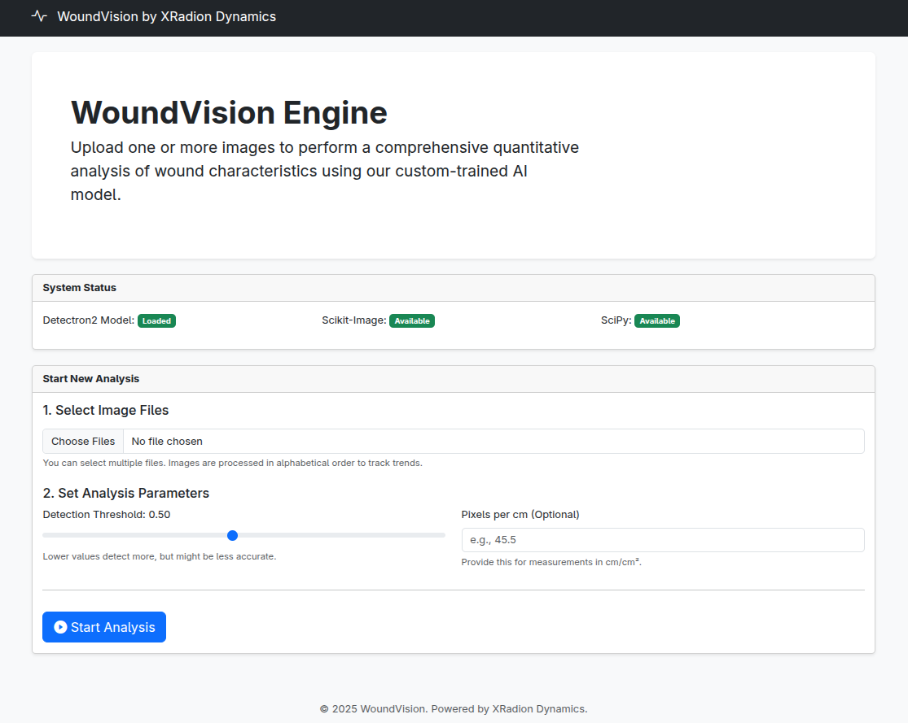

# WoundVision

Lightweight Flask + Detectron2 app for **automatic wound detection & analysis** (area, shape, color/tissue heuristics, texture, pseudo‑3D view, healing simulations) with downloadable reports using our custom-trained AI model.



---

## Features

* **Instance segmentation** of wounds with Detectron2 (Mask R‑CNN R50‑FPN).
* Per‑instance **metrics**: area, perimeter, circularity, dominant colors, sharpness, **fractal dimension (DBC)**.
* Heuristic **tissue estimate** overlays (Granulation / Slough / Necrotic / Other).
* **Peri‑wound** color summary, margin redness index, simple depth proxy.
* **Composite reports** and plots (histogram, pseudo‑3D, healing stage simulations).
* **CSV export** (`wound_metrics.csv`) and a ZIP of all results.
* **Live logs & progress** via Server‑Sent Events.

---

## Quickstart

### 1) Environment

* **Python 3.10**
* Install deps (Torch first, then Detectron2). If you vendor Detectron2 in `./detectron2`, keep the editable line last.

```bash
python -m venv venv
source venv/bin/activate
pip install --upgrade pip
pip install -r requirements.txt
pip install -e ./detectron2
```


### 2) Weights

Place your trained weights at:

```
wound_model/model_final.pth
```

* File should be **hundreds of MB** (not a tiny Git‑LFS pointer).
* If you see `invalid load key, 'v'`, you likely have an LFS pointer. Replace with the real binary or run `git lfs pull` if the remote has the file.

### 3) Run

```bash
python wound-flask.py
# open http://127.0.0.1:5000
```

Upload image(s), optionally set **pixels per cm** and **score threshold**, click **Analyze**. When done, open the **Results** page or **Download** the ZIP.

---

## How it works (high level)

* `wound-flask.py`: Flask server, file handling, background job runner, SSE streams, results packaging.
* `analysis_logic.py`: predictor setup, image/mask processing, metrics & plots:

  * **Histograms**, **dominant color** swatches.
  * **Tissue** overlay (HSV heuristics).
  * **Sharpness (Laplacian var)**, **Fractal Dimension (DBC)** with log–log fit.
  * **Pseudo‑3D** surface preview of the wound area.
  * **Healing simulations** (erosion & distance‑transform) with contour stages.
  * **Composite** figure and `wound_metrics.csv` aggregation.

By default the app uses **CPU** (`cfg.MODEL.DEVICE = "cpu"`). Switch to GPU by setting `"cuda"` if available.

---

## API (brief)

* **POST** `/analyze` — form‑data `images` (multi‑file), optional `pixels_per_cm`, `score_thresh`.
* **GET** `/stream/<job_id>` — Server‑Sent Events with `log`, `progress`, and final `status`.
* **GET** `/results/<job_id>` — simple results browser.
* **GET** `/download/<job_id>` — ZIP of the job’s outputs.

---

## License & Disclaimer

This is a research prototype. **Not a medical device.**

© 2025 WoundVision by XRadion Dynamics. See `LICENSE`.

